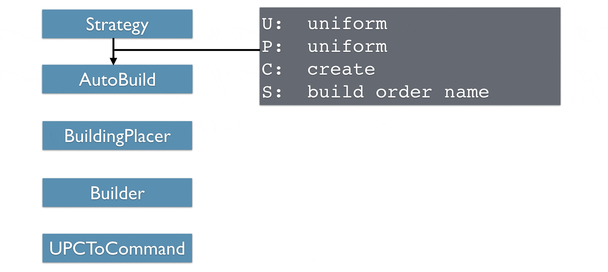

This document provides a short run-down of the core abstractions provided in TorchCraftAI and their purpose in enabling the construction of our modular, machine-friendly StarCraft: Brood War(TM) bot CherryPi.

## Player

As discussed in the [architecture overview](architecture.md), TorchCraftAI uses [TorchCraft](https://github.com/TorchCraft/TorchCraft) to play Brood War games via [BWAPI]().
The [Player]() class uses a TorchCraft client that is already connected to a server and advances the main game loop by receiving game state updates, looping through bot modules and sending commands back to the server.

## State Representation

The current game state (as advertised by TorchCraft) is made available via a per-Player [State]() object.
It offers detailed information about the current map and in-game units via [TilesInfo](), [AreaInfo]() and [UnitsInfo](), respectively.

The internal bot state is maintained in a per-State [Blackboard]() instance.
Besides offering a general key-value storage, the [Blackboard]() enables communication among Modules via [UPCTuples]() and maintains [Tasks]() spawned by Modules (see below).

## Modules

A [Module]() encapsulates a specific subset of a bot's behavior.
Common examples would be the production of units, placement of buildings, resource gathering or micro-management for battles.
All Modules implement a `step()` function that is called by the Player instance they've been added to on every game frame the bot is acting on.

A list of ready-to-use Modules available in TorchCraftAI can be found at the [modules overview](modules.md).

## UPCTuples

TorchCraftAI Modules communicate via the [Blackboard]() using a unified action space: [UPCTuples]().
They define distributions over **units**, **positions** and **commands** which are meant to be progressively refined by Modules until they can be translated to an actual game command.
Here, commands refer to a small set of abstract game commands defined by the [Command]() enumeration.
Modules typically implement logic for
- detecting UPCTuples they can refine, i.e. act upon. Those will be **consumed** from the Blackboard.
- performing the action requested by the UPCTuple, i.e. **realizing** it.
- **posting** one or more refined UPCTuples.

To enable richer communication, UPCTuples also contain a **state** field supporting a variety of types.

As a concrete example, consider the following (simplified) macro-management
setup (explanation below):

The [Strategy]() module begins by posting a UPCTuple with uniform distributions over units and positions, but with a sharp (dirac) distribution over **commands** ("create") and a string identifying a [Build Order]() as the state.
[AutoBuild](), our build planning module, instantiates the specified [Build Order](), which (over time) results in multiple UPCTuples being posted, each one specifying a unit type to be created in the state field.
For buildings, [BuildingPlacer]() will refine the **position** distribution so that it has a probability of 1 at the selected location and 0 otherwise.
Finally the [Builder]() module selects a produces and carries out the actual production, which will take a longer time in the game.
All UPCTuples that are *actionable*, i.e. that contain dirac distributions for all relevant fields, are translated into TorchCraft game commands by the [UPCToCommand]() module.

<!--The [Blackboard]() will maintain a directed graph of all UPCTuples that have been posted and consumed throughout a game.-->

## Tasks

[Task]() objects contain information the realization of a specific UPCTuple.
Thus, there exists a strict 1:1 mapping between Tasks and UPCTuples: for every UPCTuple that is consumed, a single Task can be created and posted to the [Blackboard]().
Tasks have the following purposes:
- They advertise the realization of a UPCTuple among other Modules (since they are posted to the Blackboard) and report status information regarding the realization.
- They allocate units.
If realizing a UPCTuple requires unit control, those units are allocated by adding them to the respective Task.
Note that units can only be added on Task creation; afterwards, units can only be removed.
In the example above, the [Builder]() module would maintain tasks for the buildings and units it is producing, each allocating the builder or producer unit.
- Tasks are able to track the realization of posted UPCTuples via [proxying]().
In our example, BuildingPlacer can proxy the tasks of the Builder module.
Upon task failure for constructing a building, BuildingPlacer will be informed and can select an alternative location, for example.
- As they correspond to a UPCTuple realization (and their life-time is usually bound to this), Tasks lend themselves well to storing data required for the realization.

Tasks can implement an `update()` method to update their status in reaction to internal events (such as unit re-allocation or Task cancellation) and external events (e.g. destruction of a unit carrying out necessary actions).

## Controllers

With [Modules](#modules) bundling a piece of bot functionality and [Tasks](#tasks) providing information regarding [UPCTuple](#upctuples) realization, what is the best place to actually implement the necessary logic to perform the realization?

For modules performing unit control, [Controllers]() fit the bill.
They are attached to [Tasks]() objects but implement a Module-like `step()` entry point and offer convenience functions to manage units and to post per-unit [UPCTuples]() to the Blackboard.

Some use-cases require centralized coordination of multiple units over a long period of time (e.g. [resource gathering](link-to-gatherer)).
[SharedController]() is a persistent controller tailored to this use-case and units can be added to and removed from it easily.
This controller is shared between multiple Task objects and realizes multiple UPCTuples in a centralized manner.

Modules that don't perform unit control will often refine UPCs directly in their `step()` function and immediately post the results to the Blackboard.
